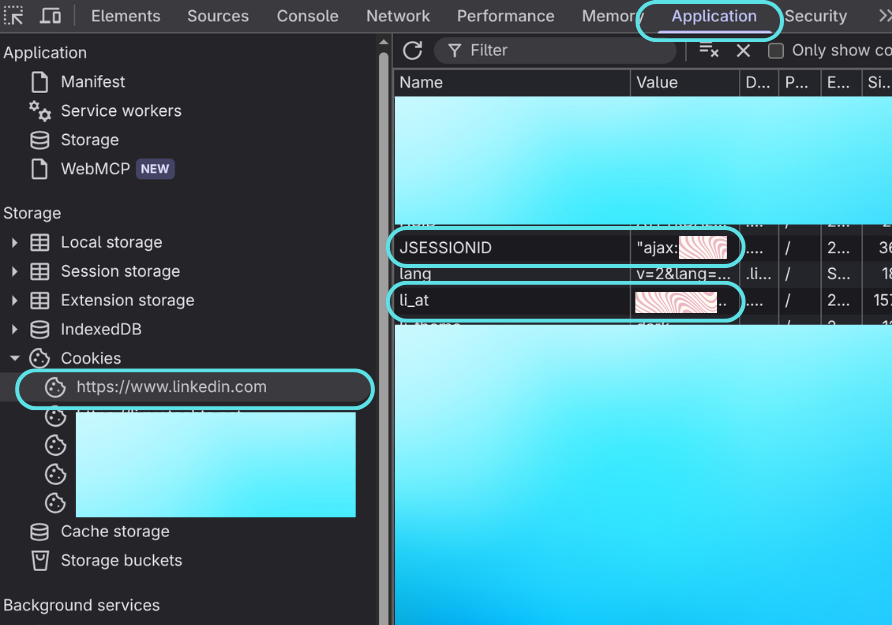

# Session cookies

Every upstream call authenticates with a signed-in LinkedIn session, made of two
cookies plus the matching browser User-Agent. The same three values are used in
two places:

- The server session, set through `LINKEDIN_LI_AT`, `LINKEDIN_JSESSIONID`, and
  `LINKEDIN_USER_AGENT` in the environment. See
  [configuration.md](configuration.md).
- An optional per-request caller session, entered in the UI's "Use your own
  LinkedIn session" panel or sent as the `X-LinkedIn-Li-At`,
  `X-LinkedIn-JSESSIONID`, and `X-LinkedIn-User-Agent` headers. See
  [api.md](api.md).

## li_at and JSESSIONID

1. Open [linkedin.com](https://www.linkedin.com) in your browser and sign in.
2. Right-click the page, choose **Inspect**, and open the **Application** tab.
3. Under **Storage**, expand **Cookies** and select `https://www.linkedin.com`.
4. Copy the values of `li_at` and `JSESSIONID`.



## User-Agent

In the same DevTools window, open the **Console** tab and run:

```js
navigator.userAgent
```

Copy the printed string. It must be the User-Agent of the browser that produced
the cookies, or LinkedIn can accept the first request and then challenge and
invalidate the session. See
[reverse-engineering.md](reverse-engineering.md#session-compatibility).

Treat all three values like passwords. Keep them in `.env` locally or in your
deployment's secret store, and never commit them. The UI sends them for a single
request and never stores them; see [security.md](security.md) for the isolation
guarantees.
